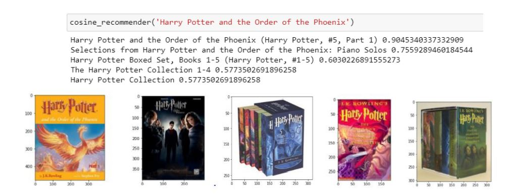
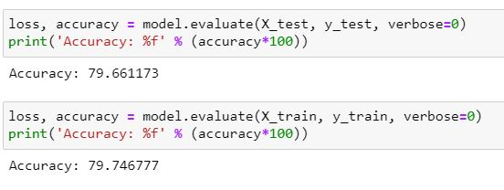
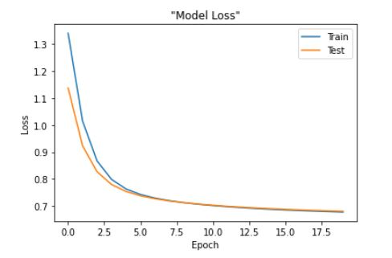
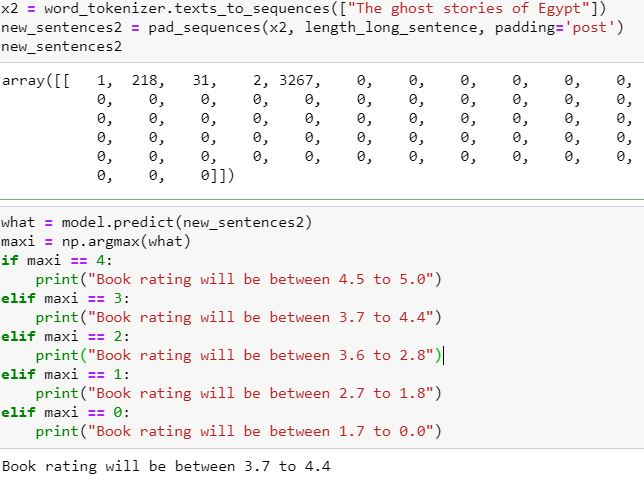

# Book-recommendation-system-and-prediction-of-ratings
A recommendation system that works on cosine similarity and a prediction system to predict the rating of books.

Despite having a very big following books rarely have a prediction or rating prediction system. This was
the main motivation behind this project. The purpose of the project is to analyze and compare the
performance of neural network models in predicting the rating of a book based on title using transfer
learning. The project also includes a recommendation model that uses the concept of cosine similarity.
The performance is evaluated using the accuracy of the models to predict data from the validation
samples from the dataset and the analysis of the loss function. Dataset used for this project is
Goodreads’ Best Books Ever dataset scraped from Goodreads. This dataset contains 48483 unique book
title values.
 

### Data

The [dataset](https://www.kaggle.com/meetnaren/goodreads-best-books?select=book_data.csv) used for this 
project is Goodreads’ Best Books Ever dataset scraped from Goodreads,
available for use on Kaggle. The dataset consists of 48483 unique book title values which have been
extensively used in the purpose of this project. The dataset also contains book ratings that have been
used as the target label in prediction. For transfer learning, [Glove](https://nlp.stanford.edu/projects/glove/)6B 100d
data was used contained 100 dimensional vectors of pre trained weights for each word. The text file contains 6B tokens for 400k
vocabulary words.

### Book Recommendation using Cosine Similarity

Cosine similarity is a metric used to measure how similar the documents are irrespective of their
size. Mathematically, it measures the cosine of the angle between two vectors projected in a
multi-dimensional space. When plotted on a multi-dimensional space, where each dimension
corresponds to a word in the document, the cosine similarity captures the orientation of the
documents for comparison. The smaller the angle, the more similar the documents are declared
to be. 
In this project cosine similarity has been used to compare the vectorized titles with each other.
When comparing the vector for each title cosine similarity checks for each vector that is similar
to the vector in question and maps the vector to a list of vectors similar to it. Upon presenting
the results the top 5 vectors in this list are given as the output.

### Prediction using Neural Networks

The prediction is done using the neural network model. The model used is Sequential, this is because
allows a user to create models layer-by-layer for most problems. It allows users to create models that
have a lot more flexibility as models where layers connect to more than just the previous and next layers
can be easily defined. Any layer can be connected to any other layer.
In this project since transfer learning was used to train the data. Pre trained weights were extracted
from Stanford’s Glove – 6b, 100d word vector dataset by loading the data into a dictionary with words
as keys and vectors as values for easy lookup. The weights were then taken for the titles in the dataset
and an embeddings matrix was made using the glove dictionary. The neural network was then applied
with the following layers in order: Embedding layer, Flatten layer, Dense layer1 with output shape 70,
Dense layer2 with output shape 5.
 
The model was then complied using SGD as the optimizer and a learning rate of 0.001. The loss function
used was ‘categorical_crossentropy’ since the output of prediction was categorical. The model was later
fit on the training data and evaluated using the validation data over 20 epochs and the results of loss
was plotted.
 
The model additionally takes an external self-given title and predicts the rating of the self-specified title
by giving the probability of each rating. The rating with the highest probability is taken to be the
predicted rating.

### Results

### Conclusion

The recommendation system output shows the expected behavior by recommending the books that
had similar keywords in them. The books with the most similar keywords were given as the topmost
output as expected. The prediction system shows a good accuracy after the analysis. The validation
accuracy comes out to be 79.66% and the training accuracy is 79.74% which suggest a good fit of the
data and the model does not seem to be under or overfit. Upon further analysis of the loss function the
arc of the plot shows a good learning rate and model performance as well which further validates the
results of accuracy values.

